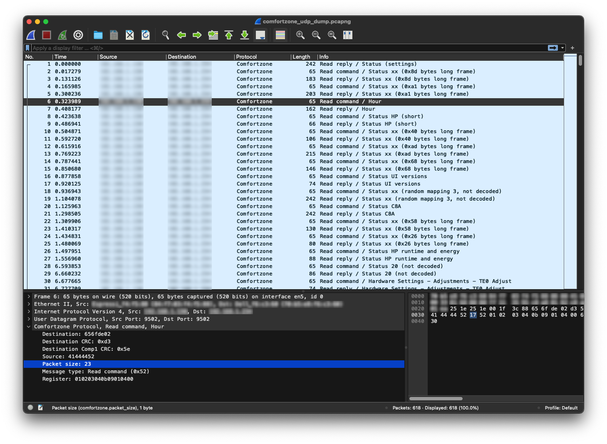

# Contributing

## Local development

Check out the repository:

```bash
# you can use your own fork as well
$ git clone git@github.com:vinnyspb/esphome-comfortzone.git
```

Modify your own YAML ESPHome config to point to your checked out repo:

```yaml
packages:
  comfortzone_package: !include path/to/esphome_comfortzone/comfortzone-package.yaml
```

If you plan to modify the comfortzone component itself, edit the
`comfortzone-package.yaml` to point to your local folder:

```yaml
external_components:
  - source: components
```

Builds can be done the same way as for a production build:

```bash
$ esphome compile comfortzone.yaml
$ esphome upload comfortzone.yaml
$ esphome logs comfortzone.yaml
```

## Adding new services / sensors

Although the encoding / decoding part is implemented in the
[comfortzone_heatpump](https://github.com/qix67/comfortzone_heatpump) library,
it is possible to use ESPHome component to simplify the process of reading new
sensors or sending new commands that the library lacks.

The process is:

1. Call a `comfortzone_debug_reroute` service from `Developer Tools -> Services` providing your development computer's local IP address and some port (e.g. `15555`).
2. Start a traffic listening tool on your development computer
3. Execute an action on the heatpump itself that you want to record (e.g. change a parameter from the built-in screen)

### Traffic listening tools

The whole data stream that is happening on RS485 link will be rerouted to your specified `IP:port` as UDP packets (1 UDP packet per 1 Modbus message).

There is a substantial amount of data, which is binary-encoded and not easily readable by human.

To simplify the analysis I've created a [fork](https://gitlab.com/vinnyspb/wireshark) of a popular Wireshark utility which includes basic decoder for ComfortZone protocol.

It does not decode every single message, but it decodes the general structure quite well, hence allows to utilize Wireshark filters to find things in the data stream.



Filtering is supported on the ComfortZone message fields, e.g.:

- `comfortzone.reg == 01:02:03:04:0b:09:81:13:00 || comfortzone.reg == 01:02:03:04:0b:09:41:13:00`
- `comfortzone.msg_type == 'W'`
- `comfortzone.dest != 41:44:44:52 && comfortzone.src != 41:44:44:52`

You can use a [mainstream Wireshark build](https://www.wireshark.org/) as well, it just won't allow you to filter ComfortZone protocol nicely and won't highlight the fields properly.

You can even use a one-liner python command and see the traffic in console:

```python
python -c "import socket; sock = socket.socket(socket.AF_INET, socket.SOCK_DGRAM); sock.bind(('', 15555)); print('Listening on port 15555...\n'); [print(''.join(f'{x:02x}' for x in data)) for data, addr in iter(lambda: sock.recvfrom(4096), 'stopped')]"
```

### What to do with captured data

Once you captured the message you need, you can implement encoding / decoding of it in the [comfortzone_heatpump](https://github.com/qix67/comfortzone_heatpump) library.

You can check out the repository locally and point your [ESPHome configuration](components/comfortzone/__init__.py) to the folder where you checked it out:

```python
cg.add_library("comfortzone_heatpump", version=None, repository="file:////path/to/local/comfortzone_heatpump")
```
