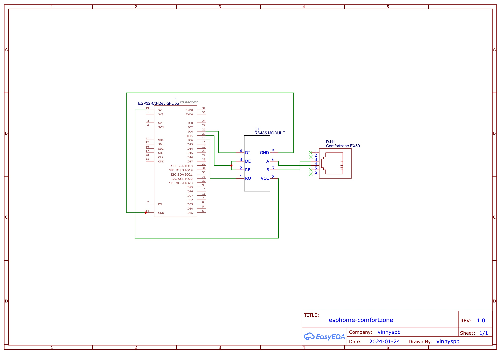
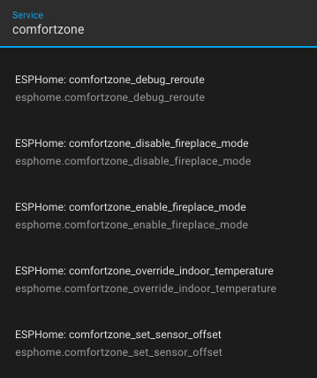

# ComfortZone EX50 component for ESPHome

This is a custom component for ESPHome that utilizes a decoder library
[comfortzone_heatpump](https://github.com/qix67/comfortzone_heatpump).
All the credits for the decoder part go to [@qix67](https://github.com/qix67/).

## Hardware

Make sure you understand what you are doing and you have all the legally required
competences and skills. Read the [README](https://github.com/qix67/comfortzone_heatpump/blob/master/README.txt) for the decoder library before wiring things. 

It can be likely run on almost any ESP32-compatible board with a RS485 module, but I used these:

- [Wemos S2 mini](https://www.wemos.cc/en/latest/s2/s2_mini.html)
- [RS485 module](https://www.aliexpress.com/item/32846149743.html)

Also tested with [OLIMEX ESP32-C3-DevKit-Lipo](https://www.olimex.com/Products/IoT/ESP32-C3/ESP32-C3-DevKit-Lipo/open-source-hardware).



## Configuration

Create a configuration file, e.g. `comfortzone.yaml` with the folowing contents,
replacing parameters as needed:
```yaml
substitutions:
  # GPIO pin on ESP32 board connected to DI pin on RS485 module
  tx_pin: "35"

  # GPIO pin on ESP32 board connected to RO pin on RS485 module
  rx_pin: "36"

  # GPIO pin on ESP32 board connected to both DE and RE pins on RS485 module
  re_de_pin: "37"

  # ComfortZone protocol version. See supported versions in:
  # https://github.com/qix67/comfortzone_heatpump/blob/master/comfortzone_config.h#L4-L6
  comfortzone_protocol_version: "180"

  # git branch to use for the source code, can be changed during development
  git_branch: "main"

packages:
  comfortzone_package: github://vinnyspb/esphome-comfortzone/comfortzone-package.yaml@${git_branch}

esphome:
  # Choose a hostname for the ESP32 board on your network
  name: comfortzone

esp32:
  # Your board type, choose correct one from:
  # https://docs.platformio.org/en/latest/boards/index.html
  board: lolin_s2_mini
  framework:
    type: esp-idf
  # Depending on your board type, you may need more parameters, e.g.
  # for ESP32-S3 and -C3 based boards, you may need to add:
  #   platformio_options:
  #     board_build.flash_mode: dio

logger:
  # Recommended to keep logging disabled (NONE) for performance reasons.
  # Enable if required for debugging (DEBUG, INFO, ERROR levels).
  level: NONE

ota:
  - platform: esphome
    password: !secret ota_password

wifi:
  ssid: !secret wifi_ssid
  password: !secret wifi_password
  power_save_mode: none

```

Put a `secrets.yaml` file to the same directory which should contain all the necessary credentials:

```yaml
wifi_ssid: "wifi network name"
wifi_password: "wifi password"
ota_password: "create a random password for OTA updates through ESPHome"
```

## Build and run

```bash
$ esphome compile comfortzone.yaml
$ esphome upload comfortzone.yaml
$ esphome logs comfortzone.yaml
```

# Services exposed to Home Assistant



You can find the full list in [the source code declaration](components/comfortzone/comfortzone_esphome.cpp) under comment:

```cpp
// Services exposed to Home Assistant are declared here
```

## Home Assistant Dashboard

Create an empty dashboard in Home Assistant and copy [YAML config](home-assistant-dashboard/home-assistant-dashboard.yaml)
into it's raw configuration editor. Put images from the [dashboard folder](home-assistant-dashboard/) into `www` folder
of Home Assistant.